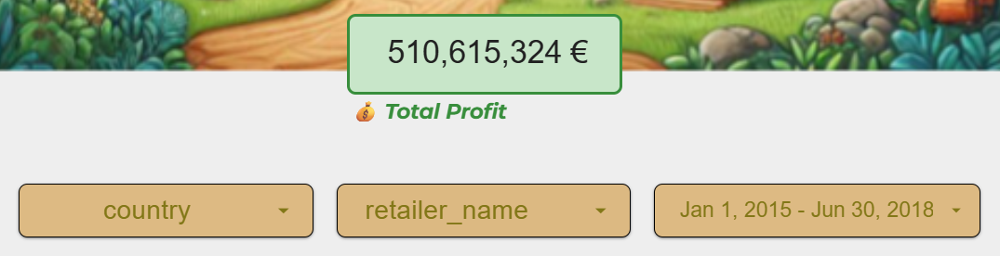
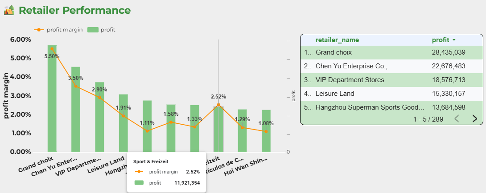
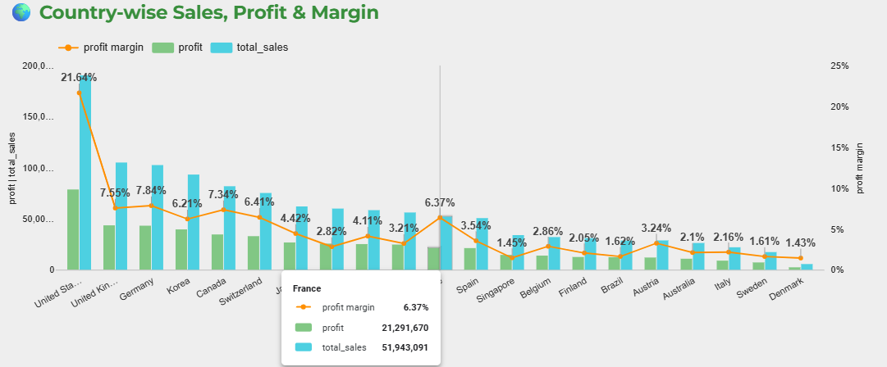
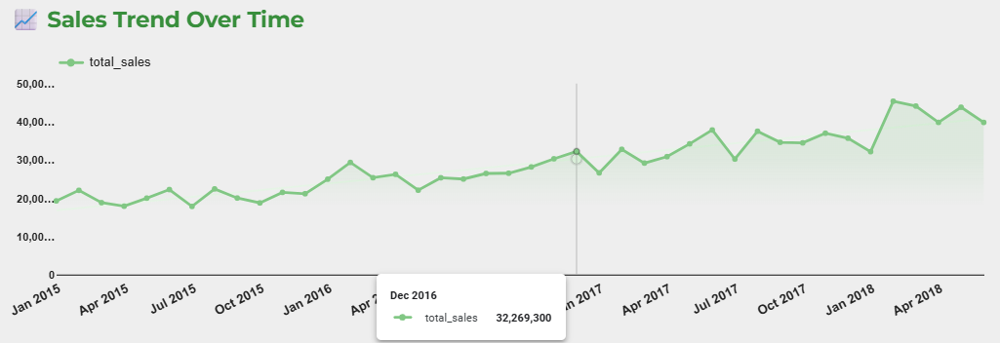
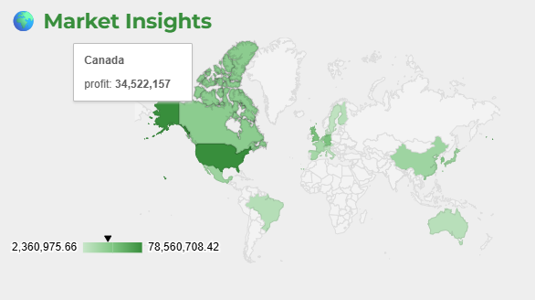
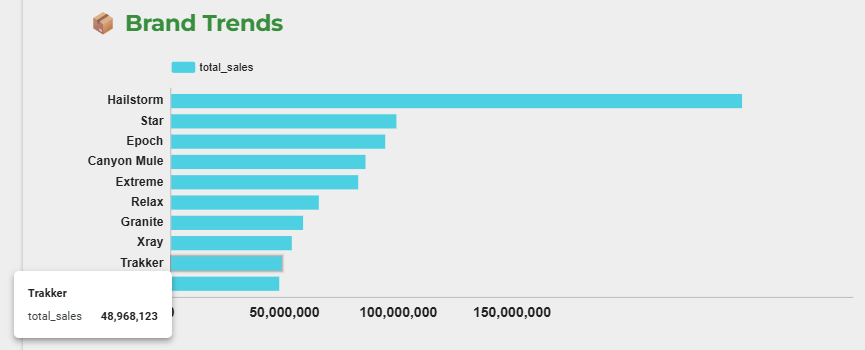

# Looker Studio Dashboard for Retail & Growth

This dashboard was created to showcase Profit and Retail Relationships. It was also built to help track retailer and market performance quickly.

🔗 Access the dashboard here: [Open Dashboard](https://lookerstudio.google.com/reporting/44c23ec8-6a90-4a8b-aebc-8bc094e545c9/page/lzVMF/edit)

---

## Dashboard Sections

### 1. Total Profit Scorecard
- It provides an instant sense of overall business health.

After the scorecard, there are three filters that can be used to drill into specific countries, retailers, or date ranges as needed.

### 2. Retailer Performance
- Here we can evaluate which partners are delivering the most profit and which may need support or reevaluation. 
- It also includes margin percentage, which gives us a deeper view beyond just revenue.

### 3. Country-wise Sales, Profit and Margin
- This graph helps us spot which markets are most profitable and where margin might need improvement (useful for regional strategy).

### 4. Sales Trends Over Time
- With this graph we can explore how revenue is progressing month over month, helping to spot trends, seasonality, or the impact of specific partnerships.

### 5. Market Insights Map
- This map offers a geographic view of profit distribution — a great way to visualize where we're strong and where there's room to grow.

### 6. Brand Trends
- This last graph helps us see which brands are driving the most sales, supporting more targeted conversations with retailers around product mix and promotions.

As a final note, the dashboard is fully interactive. The user can use it to support partner calls, strategy meetings, or quick check-ins. Besides that, the graphs are connected to each other, which allows them to act as dynamic filters.